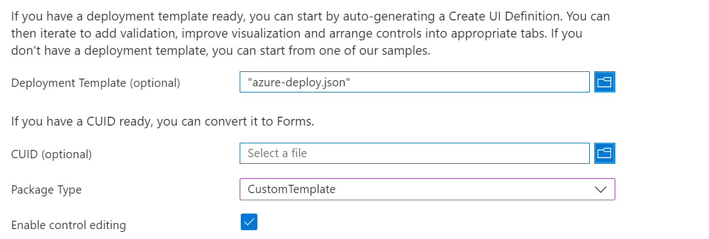
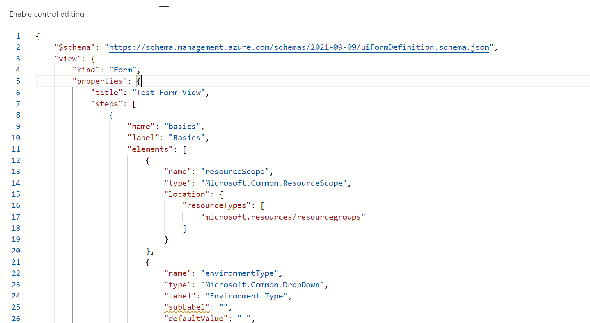

**Recap**

Part 1

- Covered basics of JSON
- JSON Schemas
- Editing with VS Code
- Azure CLI/PowerShell
- ARM Templates

Part 2

- Template quick starts
- Template specs
- Template spec versioning
- Template spec linked templates
- Template spec deployment from DevOps

Part 3

- Bicep / Why use IaaC?
- Bicep vs. ARM
- Bicep Parameters
- Loops / Conditionals / etc

Part 4 

- Bicep to Repo to Azure
- Azure Managed Applications

**Introduction** 

Requirements for JHMI/JHU are similar to:
- A completely custom user interface served up via the Azure Portal.
- Integration with Azure Key Vault for certain sensitive values (e.g., passwords) so that they are not displayed, and the user cannot enter.
- Enforcement and validation of naming conventions on various fields, with appropriate interactive guidance and feedback. For example, all VMs must start with the letters “VM_.”
- Limitations on certain fields (e.g., regions allowed size/family of VM, etc.).
- Forced usage of existing VNets and resource groups.
- All scripts should be contained in a private GitHub repository. (ours is public for simplicity)
- Ability to provide data via custom parameters on the portal interface that gets passed into a PowerShell script, which gets automatically invoked upon VM creation. An example would be allowing the user creating the VM to specify via a “Yes/No” parameter whether Microsoft Internet Information Services (IIS) should be installed upon VM creation.

**Custom Azure Portal Interfaces - createUiDefinition.json**

You can create a form that appears in the Azure portal to assist users in deploying a template spec. The form allows users to enter values that are passed as parameters to the template spec.

When you create the template spec, you package the form and Azure Resource Manager template (ARM template) together. Deploying the template spec through the portal automatically launches the form.

Then, we can pass both the template and createUiDefinition.json to the Azure Portal via a URL to create a custom interface for the user to deploy the template.

**Creating a form**

Reference: 
https://github.com/Azure/portaldocs/blob/main/portal-sdk/generated/dx-view-formViewType.md

Link to Form View Sandbox:
https://aka.ms/form/sandbox

1. Go to the Form View Sandbox
2. Select CustomTemplate in the Package Type
3. In Deployment template, paste the contents of an ARM template file
4. Preview the form to verify it looks as expected

This creates the UI json file that can be used in the createUiDefinition.json file.

**Form overview**

-Form steps

```
{
  "$schema": "https://schema.management.azure.com/schemas/2021-09-09/uiFormDefinition.schema.json#",
  "view": {
    "kind": "Form",
    "properties": {
      "title": "Key Vault and secret",
      "steps": [
        {
          "name": "basics",
          "label": "Basics",
          "elements": [
            ...
          ]
        },
        {
          "name": "keyvault",
          "label": "Key Vault",
          "elements": [
          ]
        },
        {
          "name": "permissions",
          "label": "Permissions",
          "elements": [
          ]
        },
        {
          "name": "secret",
          "label": "Secret",
          "elements": [
          ]
        }
      ]
    },
    "outputs": {
      ...
    }
  }
}
```

Note that if you adjust the steps then the output needs to be modified

```
"outputs": {
  "parameters": {
    ...
    "secretName": "[steps('secret').secretName]",
    "secretValue": "[steps('secret').secretValue]"
  }
```

Checkbox:

```
{
                "name": "legalAccept",
                "type": "Microsoft.Common.CheckBox",
                "label": "I agree to the terms and conditions.",
                "constraints": {
                    "required": true,
                    "validationMessage": "Please acknowledge the legal conditions."
                }
            }
```

Credentials combo:

```
{
                "name": "credentialsCombo1",
                "type": "Microsoft.Compute.CredentialsCombo",
                "label": {
                    "password": "Password",
                    "confirmPassword": "Confirm password"
                },
                "toolTip": {
                    "password": ""
                },
                "constraints": {
                    "required": true,
                    "customPasswordRegex": "^(?=.*[A-Za-z])(?=.*\\d)[A-Za-z\\d]{12,}$",
                    "customValidationMessage": "The password must be alphanumeric, contain at least 12 characters, and have at least 1 letter and 1 number."
                },
                "options": {
                    "hideConfirmation": false
                },
                "osPlatform": "Windows",
                "visible": true
            }
```


Dropdown:
```
{
                "name": "dropDown1",
                "type": "Microsoft.Common.DropDown",
                "label": "Example drop down",
                "placeholder": "",
                "defaultValue": "Value two",
                "toolTip": "",
                "constraints": {
                    "allowedValues": [
                        {
                            "label": "Value one",
                            "value": "one"
                        },
                        {
                            "label": "Value two",
                            "value": "two"
                        }
                    ],
                    "required": true
                },
                "visible": true
            }
```

Editable grid:
```

{
                "name": "people",
                "type": "Microsoft.Common.EditableGrid",
                "ariaLabel": "Enter information per person",
                "label": "People",
                "constraints": {
                    "width": "Full",
                    "rows": {
                        "count": {
                            "min": 1,
                            "max": 10
                        }
                    },
                    "columns": [
                        {
                            "id": "colName",
                            "header": "Name",
                            "width": "1fr",
                            "element": {
                                "type": "Microsoft.Common.TextBox",
                                "placeholder": "Full name",
                                "constraints": {
                                    "required": true,
                                    "validations": [
                                        {
                                            "regex": "^[a-z0-9A-Z]{1,30}$",
                                            "message": "Only alphanumeric characters are allowed, and the value must be 1-30 characters long."
                                        }
                                    ]
                                }
                            }
                        },
                        {
                            "id": "colGender",
                            "header": "Gender",
                            "width": "1fr",
                            "element": {
                                "name": "dropDown1",
                                "type": "Microsoft.Common.DropDown",
                                "placeholder": "Select a gender...",
                                "constraints": {
                                    "allowedValues": [
                                        {
                                            "label": "Female",
                                            "value": "female"
                                        },
                                        {
                                            "label": "Male",
                                            "value": "male"
                                        },
                                        {
                                            "label": "Other",
                                            "value": "other"
                                        }
                                    ],
                                    "required": true
                                }
                            }
                        },
                        {
                            "id": "colContactPreference",
                            "header": "Contact preference",
                            "width": "1fr",
                            "element": {
                                "type": "Microsoft.Common.OptionsGroup",
                                "constraints": {
                                    "allowedValues": [
                                        {
                                            "label": "Email",
                                            "value": "email"
                                        },
                                        {
                                            "label": "Text",
                                            "value": "text"
                                        }
                                    ],
                                    "required": true
                                }
                            }
                        }
                    ]
                }
            }
```

Virtual network combo

```
{
                "name": "vnetCombo1",
                "type": "Microsoft.Network.VirtualNetworkCombo",
                "label": {
                    "virtualNetwork": "Virtual network",
                    "subnets": "Subnets"
                },
                "toolTip": {
                    "virtualNetwork": "",
                    "subnets": ""
                },
                "defaultValue": {
                    "name": "vnet01",
                    "addressPrefixSize": "/16"
                },
                "constraints": {
                    "minAddressPrefixSize": "/16"
                },
                "options": {
                    "hideExisting": false
                },
                "subnets": {
                    "subnet1": {
                        "label": "First subnet",
                        "defaultValue": {
                            "name": "subnet-1",
                            "addressPrefixSize": "/24"
                        },
                        "constraints": {
                            "minAddressPrefixSize": "/24",
                            "minAddressCount": 12
                        }
                    },
                    "subnet2": {
                        "label": "Second subnet",
                        "defaultValue": {
                            "name": "subnet-2",
                            "addressPrefixSize": "/26"
                        },
                        "constraints": {
                            "minAddressPrefixSize": "/26",
                            "minAddressCount": 8
                        }
                    }
                },
                "visible": true
            }
```

**Put It All Together**

The process:

Pre-requisite: create Bicep modules that represent the way you deploy the building blocks for the Azure services you deploy: storage accounts, vnets, key vaults, app services, etc.

1. Create a Bicep or ARM template for each service you commonly deploy (referencing the modules)
2. If using Bicep, compile the template to ARM
3. Create a createUiDefinition.json file for each service using the Azure Portal
4. Create/update a Git repository with the ARM template, createUiDefinition.json, and any other necessary files
5. Build the "Deploy to Azure" button URL and add it to the README.md file in the repository
6. Click to test

Note: this example uses a public Github repository, but you can use a private repository as well by using a proxy function app. The json files need to be accessible from the Azure portal (could also use an internal only URL, assets are retrieved via the browser when in the Azure portal)

** 1. Create Bicep template **

Review modules folder:
    appService
    storage
    vnet

Determine the type of service you are creating and create a Bicep file referencing the modules that will be used to deploy the service.

Here - "service" means a type of deployment that is commonly requested or used. You can work backwards from an existing Azure deployment as well if you have built something that works.

1. Find service(s) deployed in Azure, go to Automation -> Export template
2. Create an ARM template JSON file from the file
3. Decompile the ARM template to Bicep

```
az bicep decompile --file main.json
```

Note: warnings will be generated, some properties may be read only or not supported to be hard coded.

** 2. If using Bicep, compile the template to ARM **

Take the Bicep file and compile it to ARM so that it can be used in the form builder tool. 

`az bicep build --file .\1-app-with-storage.bicep`

** 3. Create a createUiDefinition.json file for each service using the Azure Portal **

Take the now compiled ARM template and use the Azure Portal to create a form for the service.

Go to the Form View Sandbox:
https://aka.ms/form/sandbox

Select your Deployment Template (the ARM file compiled from the Bicep file)
Select CustomTemplate for Package Type




Make changes to the form as needed, add new steps, form fields etc.

Make sure to update outputs if you add new steps.

Once the new UI definition is created and looks good in the preview step, save that file as part of the repository.

** 4. Create/update a Git repository with the ARM template, createUiDefinition.json, and any other necessary files **

Update your Git repository to add the ARM template, the createUiDefinition.json file, and a README.md file with the "Deploy to Azure" button. In the README.md file add details about the service type you created and any pre-requisites or expected parameters. 

I suggest doing an initial commit and push to the repository so you can verify the URLs that will be used for the Deploy to Azure button.

Demo:
-show files in Github repo
-show how to get raw URL contents link

** 5. Build the "Deploy to Azure" button URL and add it to the README.md file in the repository **

The deploy to Azure button is a button that can be exposed to your end users that are not familiar with scripting/automation so they can deploy the service to Azure with your presets and custom form.

The button is built using a URL that points to the ARM template and the createUiDefinition.json file in the repository.

The URL is built using the following format:

`https://portal.azure.com/#blade/Microsoft_Azure_CreateUIDef/CustomDeploymentBlade/uri/[link_to_arm_json]/uiFormDefinitionUri/[link_to_createUiDefinition_json]`

Note that the links to the files are the raw URL links from the Github repository and need to be URL encoded.

Example:

ARM JSON:
https://raw.githubusercontent.com/danfsnet/jhu-deployment/master/services/1-app-with-storage/azure-deploy.json

createUiDefinition.json:
https://raw.githubusercontent.com/danfsnet/jhu-deployment/master/services/1-app-with-storage/createUiDefinition.json

URL encode those links and add to the formula:
https://portal.azure.com/#blade/Microsoft_Azure_CreateUIDef/CustomDeploymentBlade/uri/https%3A%2F%2Fraw.githubusercontent.com%2Fdanfsnet%2Fjhu-deployment%2Fmaster%2Fservices%2F1-app-with-storage%2Fazure-deploy.json/uiFormDefinitionUri/https%3A%2F%2Fraw.githubusercontent.com%2Fdanfsnet%2Fjhu-deployment%2Fmaster%2Fservices%2F1-app-with-storage%2FcreateUiDefinition.json

(alternatively you could create a PowerShell script to do the URL encoding and link creation for you)

```
param(
    [Parameter(Mandatory=$true)]
    [string]$link_to_arm_json,

    [Parameter(Mandatory=$true)]
    [string]$link_to_createUiDefinition_json
)

# URL encode the input paths
$link_to_arm_json = [System.Web.HttpUtility]::UrlEncode($link_to_arm_json)
$link_to_createUiDefinition_json = [System.Web.HttpUtility]::UrlEncode($link_to_createUiDefinition_json)

# Construct the URL
$url = "https://portal.azure.com/#blade/Microsoft_Azure_CreateUIDef/CustomDeploymentBlade/uri/$link_to_arm_json/uiFormDefinitionUri/$link_to_createUiDefinition_json"

# Output the URL
Write-Output $url
```
Then to run it:

`.\script.ps1 -link_to_arm_json "path_to_arm_json" -link_to_createUiDefinition_json "path_to_createUiDefinition_json"`

Once you have the URL, paste it into your active Azure session to verify it loads correctly. If it does, add it to the README.md file in the repository.

```
[](https://portal.azure.com/#blade/Microsoft_Azure_CreateUIDef/CustomDeploymentBlade/uri/https%3A%2F%2Fraw.githubusercontent.com%2Fdanfsnet%2Fjhu-deployment%2Fmaster%2Fservices%2F1-app-with-storage%2Fazure-deploy.json/uiFormDefinitionUri/https%3A%2F%2Fraw.githubusercontent.com%2Fdanfsnet%2Fjhu-deployment%2Fmaster%2Fservices%2F1-app-with-storage%2FcreateUiDefinition.json)
```

[](https://portal.azure.com/#blade/Microsoft_Azure_CreateUIDef/CustomDeploymentBlade/uri/https%3A%2F%2Fraw.githubusercontent.com%2Fdanfsnet%2Fjhu-deployment%2Fmaster%2Fservices%2F1-app-with-storage%2Fazure-deploy.json/uiFormDefinitionUri/https%3A%2F%2Fraw.githubusercontent.com%2Fdanfsnet%2Fjhu-deployment%2Fmaster%2Fservices%2F1-app-with-storage%2FcreateUiDefinition.json)


** 6. Update your Git repo (and push) and click to test **

Browse to your repository URL and click the Deploy to Azure button and test the deployment.

**Questions?**


**Azure Managed Applications**

To publish a managed application to your service catalog, do the following tasks:

- Create an Azure Resource Manager template (ARM template) that defines the resources to deploy with the managed application.
- Define the user interface elements for the portal when deploying the managed application.
- Create a .zip package that contains the required JSON files. The .zip package file has a 120-MB limit for a service catalog's managed application definition.
- Publish the managed application definition so it's available in your service catalog.


